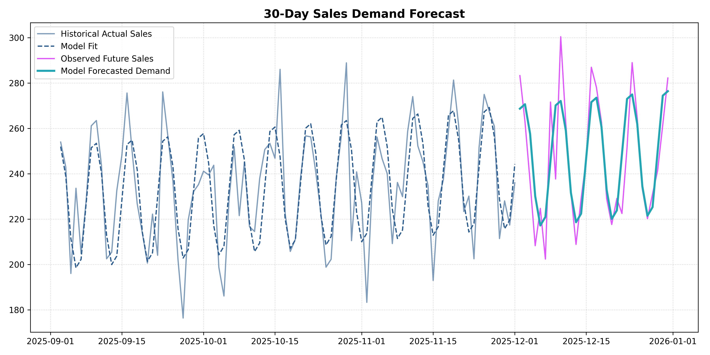

# FUTURE_ML_01
# Store Sales & Demand Forecasting 📈

## Project Objective
The goal of this project is to analyze historical retail sales data to predict future demand. Beyond building an accurate forecasting model, this project focuses on extracting insights regarding sales trends and seasonality to assist business managers, store owners and startup founders in strategic inventory and financial planning.

---

## Tech Stack & Libraries
- **Language:** Python
- **Environment:** VS Code
- **Data Manipulation:** Pandas, NumPy
- **Machine Learning:** Scikit-learn (Linear Regression / Time-Series features)
- **Data Visualization:** Matplotlib / Seaborn

---

## Key Implementation Steps

### 1. Data Cleaning & Preparation
- Handled missing values and verified data consistency.
- Set time-based indices to properly handle chronological ordering.

### 2. Time-Based Feature
- **Trend Estimation:** Modeled long-term sales growth/decline.
- **Seasonality:** Extracted cyclical patterns (e.g., day of the week, month, holidays) using lag features and deterministic indicators to capture consumer behavior variations.

### 3. Forecasting Strategy
- Developed a regression-based time-series forecasting model to map past relationships onto future timelines.

### 4. Model Evaluation
- Evaluated performance using business-relevant error metrics to ensure reliability.

---

## Key Insights & Business Impact

**What the Forecast Means:**
The time-series forecasting model analyzed two years of historical sales records to map out future product demand. By evaluating patterns, the model broke down sales into two distinct components:

- **The Upward Trend:** The business is experiencing steady, continuous growth over time. The baseline demand increases from an average of 100 units to 250 units over the two-year timeline.

- **Weekly Seasonality:** There is a highly predictable cyclical pattern every week. Sales consistently reach their peak during the middle of the week and experience a drop-off over the weekends.

The final 30-day forecast successfully shows these exact trends and weekly cycles with high accuracy, maintaining a low Mean Absolute Error (MAE).

**Business Planning Applications:** 
- **Inventory & Stock Management:** Instead of guessing how much inventory to order, managers can use the forecasted demand curves to order exact stock quantities. This prevents running out of products during high-demand days and minimizes the capital held up in buying excessive quantity of items and storing it in a warehouse during low-demand days.
- **Staff Scheduling & Labour Optimization:** Since the forecast clearly outlines which days of the week experience maximum consumer traffic, managers can plan out their employee shift schedules accordingly. More staff can be scheduled on high-demand days to improve customer service, and the number of staff can be reduced on lower-demand days to reduce labour expenses.
- **Financial Budgeting & Cash Flow Forecasting:** By observing predicted demand, the revenue can be expected. So, a startup founder or business manager can plan out future monthly cash flow. This allows the business to plan larger capital expansions, marketing campaigns or equipment purchases when the revenue is predicted to be high.
